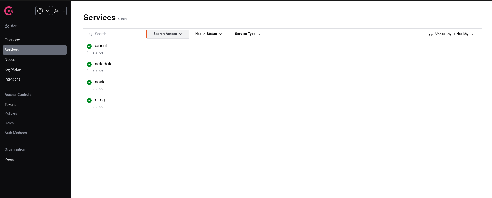
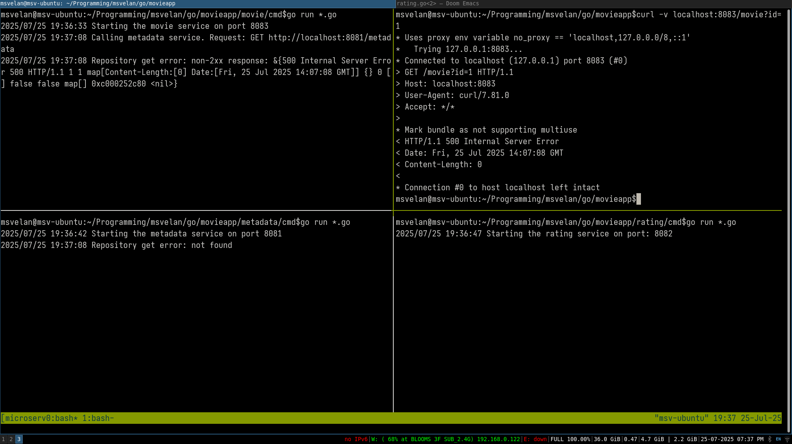

# Table of Contents

1.  [Objective](#org60be343)
2.  [System design](#orgf27dc3d)
3.  [Microservice design](#orgc0b9a6a)
    1.  [Movie metadata service](#org9f21e3f)
    2.  [Rating service](#orgd0d1314)
    3.  [Movie service](#org1084d56)
4.  [Steps helpful while creating a microservice](#org78d5f4e)
5.  [Service Discovery](#org43f815f)
    1.  [Registry](#orgb689dd3)
    2.  [Discovery models](#org9e855d0)
    3.  [Service Health monitoring](#org2d44812)
    4.  [Service Discovery solutions](#orge6745d8)
6.  [Serialization and Deserialization of data](#orgbce5b9e)

# Objective

To design a movie app, for now say the planned features:

-   Get movie metadata (title, yr, desc, director) and aggregrated rating
-   Rate a movie

# System design

We notice that movie metadata is static mostly and won&rsquo;t be changed much whereas ratings are dynamic and can be dynamic.
Ratings also should be aggregated on the go or we should store the aggregated data somewhere.
This hints us that its better to separate movies and ratings service.

Now say the ratings service expands and we know want to facilitate the rating of actor, movie soundtrack along with the movies themselves.
Considering this now the API&rsquo;s exposed by the ratings service:

-   Store the rating record (UserId, RecordType, RecordID, RatingsValue)
-   Get the aggregated rating for a record by its ID and type.

We also notice that the logic is loosely coupled, data models are different and data is mostly independent.
This justifies the separation of services.

Now say that later we also want to integrate likes and recommendations, we can&rsquo;t just add it to the movies metadata service,
it would be better if we have a separate movie service and add the likes, reviews, recommendations to it instead.
This way the metadata service just holds the static data of the movies.

# Microservice design

Each microservice can contain 1 or more packages to handle the following roles:

-   API handlers
-   Business/application logic
-   Database logic
-   Interaction with other services

When the applications primary purpose is to handle API requests, its not necessary to separate business logic from API handlers.
Although it is advised to separate because when we change from one type of API to another (say HTTP to gRPC) or support both,
there is no need to implement the same logic twice or rewrite it.

Go community doesn&rsquo;t provide specific naming convention for handling such roles, but I have used the following names:

-   **controller**: Business logic (This is also called as service directory in some projects)
-   **gateway**: Logic for interacting with other services
-   **handler**: API handlers
-   **repository**: Database Logic
-   **internal**: All code that won&rsquo;t be exported
-   **pkg**: Exported structures reside here.

## Movie metadata service

-   API: Get metadata for a movie
-   Database: Movie metadata database
-   Interacts with services: None
-   Data model type: Movie metadata

## Rating service

-   API: Get the aggregated rating for a record and write a rating
-   Database: Rating database
-   Interacts with service: None
-   Data model type: Rating

## Movie service

-   API: Get movie details, including aggregated ratings and movie metadata
-   Database: None
-   Interacts with service: Movie metadata and rating
-   Data model type: Movie details

# Steps helpful while creating a microservice

First create the model(data model), then repository(deals with storing that data model somewhere), then create the controller(business logic while operates on the data model).
After this create the handler and pass on to the API handler function.

The caller first creates the model structure(data), then pass that to the controller. Pass the controller to the handler,
pass the handler to the API.

Data model will be used by the caller mostly, so place that in pkg directory, whereas the controller, repository and handlers can be placed in the internal directory.

Controller provides some interface and the repository will implement, for example: (metadata repository implement Get and Put functions).

# Service Discovery

We have pre-programmed static values of the addresses of services (Metadata-localhost:8081, Rating-localhost:8082, Movie-localhost:8083).
The problem with this is that how do we handle multiple instances of a service and how to handle if some of the instances aren&rsquo;t available.

Well, we can keep a list of addresses in each service for each of the other service instances.
Although now, each time we add or remove a service instance, we need to update this in each calling service. If an instance becomes unavailable, the services will keep calling until its configuration is updated.

The solution for this is to use service discovery.

## Registry

Service registry stores information about available service instances. It has features such as register an instance of a service, deregister an instance of a service, return the list of all instances of the service in the form of network addresses. The registry monitors the health of the instances.

## Discovery models

-   Client-side service discovery: Access the registry directly from the application using a registry client. Load balancing has to be done by the application.

-   Server-side service discovery: Access the register indirectly via a load balancer, a special server that forwards requests to available instances.

## Service Health monitoring

-   Pull model: Registry periodically performs health check for each known service.
-   Push model: The application renews its status by contacting the service registry.

## Service Discovery solutions

Popular service discovery solutions include HashiCorp Consul and Kubernetes.

In this project I have used hashicorp-consul for service discovery and this is status when all services are running.
Note: The in-memory implementation isn&rsquo;t fully developed yet. We have to abstract the logic to a new service which creates new registry in a hostPort and accepts connections from services on that hostPort. This is how we avoid sharing the same registry object among multiple services. Since HashiCorp-Consul already has this implementation, we proceed to go with that.

In the following image, we see that the movie microservice is correctly calling the metadata microservice with its correct URL.

# Serialization and Deserialization of data

Currently we are using JSON for serialization of data and passing it over HTTP for communication between services. The issue with using JSON format is that it can be slower compared to other formats and the size is more.

There are other data serialization formats such as XML (size is largest compared to its alternatives), YAML(greater size after serialization, supports comments), Apache Thrift(requires defining models in their own format, 30% to 50% lesser size compared to XML or JSON, there are better options for encoding), Apache Avro (supports versioning, we can define data in JSON or Avro IDL), Protocol buffers (simplicity of language, small data output size, high performance, protocol evolution, define services and compile to target programming language).

To put into perspective, the script in the cmd/sizecompare directory is used to measure the size of the serialized sample data and speed of serialization comparing JSON, XML and protobuffers and here is the result:

We see that XML serialized data is almost 40% more than JSON serialized data, whereas Proto serialized data is less than 50% of the JSON serialized data.

Comparing the serialization speed:

Here we see that Proto serialization is atleast 40% faster than JSON serialization and almost 16 times faster than XML serialization.

Protocol buffers is a popular option and we will be using this for our project.

