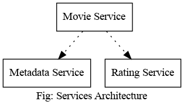

# Table of Contents

1.  [Services implemented:](#org78fbf5d)
    1.  [Movie metadata service](#org281bad1)
    2.  [Rating service](#org39ccedc)
    3.  [Movie service](#orgf7491ce)
2.  [Other Details](#orgc27d10e)

This repository consists of three microservices: movie, metadata and rating. This is a practice project that I used to learn about microservices.

# Services implemented:

## Movie metadata service

-   API: Get metadata for a movie
-   Database: Movie metadata database
-   Interacts with services: None
-   Data model type: Movie metadata

## Rating service

-   API: Get the aggregated rating for a record and write a rating
-   Database: Rating database
-   Interacts with service: None
-   Data model type: Rating

## Movie service

-   API: Get movie details, including aggregated ratings and movie metadata
-   Database: None
-   Interacts with service: Movie metadata and rating
-   Data model type: Movie details
    
    

# Other Details

Implemented service discovery with HashiCorp/Consul, implemented synchronous communication using HTTP API endpoints as well as gRPC endpoints.
For more details on how I implemented this, please check out <./notes.md>.

