# Table of Contents

1.  [Objective](#org7f2cc32)
2.  [System design](#orga8c463e)
3.  [Microservice design](#org141c70c)
    1.  [Movie metadata service](#org47e5cbc)
    2.  [Rating service](#org92760c2)
    3.  [Movie service](#org427d616)
4.  [Steps helpful while creating a microservice](#orge5f8f65)
5.  [Service Discovery](#orgf3d314e)
    1.  [Registry](#org4d6c5af)
    2.  [Discovery models](#org96dd8fe)
    3.  [Service Health monitoring](#orge710074)
    4.  [Service Discovery solutions](#org50e67c8)
6.  [Serialization and Deserialization of data](#org2a39b11)
7.  [Synchronous Communication](#org0a683c3)
8.  [Asynchronous Communication](#org4a46095)
    1.  [Basics](#org8aef771)
    2.  [Pros and Cons](#orge23403c)
        1.  [Pros](#orge11c403)
        2.  [Cons](#orgc3cf65f)
    3.  [Message Broker](#orgafe7890)
    4.  [Patterns of asynchronous communication](#org674fb48)
        1.  [Publisher-subscriber model](#orge50be17)
        2.  [Message Queue model](#org495af86)
    5.  [Event Driven Architecture(EDA) Patterns](#org761f30f)
    6.  [Using Apache Kafka as the message broker](#orgb8e210f)
        1.  [Application to produce ratings data](#orgd2bae5b)
        2.  [Rating Data Consumer](#org3ff73e8)
    7.  [Results](#org99e459d)

# Objective

To design a movie app, for now say the planned features:

-   Get movie metadata (title, yr, desc, director) and aggregrated rating
-   Rate a movie

# System design

We notice that movie metadata is static mostly and won&rsquo;t be changed much whereas ratings are dynamic and can be dynamic.
Ratings also should be aggregated on the go or we should store the aggregated data somewhere.
This hints us that its better to separate movies and ratings service.

Now say the ratings service expands and we know want to facilitate the rating of actor, movie soundtrack along with the movies themselves.
Considering this now the API&rsquo;s exposed by the ratings service:

-   Store the rating record (UserId, RecordType, RecordID, RatingsValue)
-   Get the aggregated rating for a record by its ID and type.

We also notice that the logic is loosely coupled, data models are different and data is mostly independent.
This justifies the separation of services.

Now say that later we also want to integrate likes and recommendations, we can&rsquo;t just add it to the movies metadata service,
it would be better if we have a separate movie service and add the likes, reviews, recommendations to it instead.
This way the metadata service just holds the static data of the movies.

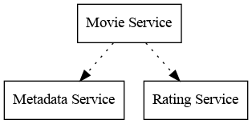

# Microservice design

Each microservice can contain 1 or more packages to handle the following roles:

-   API handlers
-   Business/application logic
-   Database logic
-   Interaction with other services

When the applications primary purpose is to handle API requests, its not necessary to separate business logic from API handlers.
Although it is advised to separate because when we change from one type of API to another (say HTTP to gRPC) or support both,
there is no need to implement the same logic twice or rewrite it.

Go community doesn&rsquo;t provide specific naming convention for handling such roles, but I have used the following names:

-   **controller**: Business logic (This is also called as service directory in some projects)
-   **gateway**: Logic for interacting with other services
-   **handler**: API handlers
-   **repository**: Database Logic
-   **internal**: All code that won&rsquo;t be exported
-   **pkg**: Exported structures reside here.

## Movie metadata service

-   API: Get metadata for a movie
-   Database: Movie metadata database
-   Interacts with services: None
-   Data model type: Movie metadata

## Rating service

-   API: Get the aggregated rating for a record and write a rating
-   Database: Rating database
-   Interacts with service: None
-   Data model type: Rating

## Movie service

-   API: Get movie details, including aggregated ratings and movie metadata
-   Database: None
-   Interacts with service: Movie metadata and rating
-   Data model type: Movie details

# Steps helpful while creating a microservice

First create the model(data model), then repository(deals with storing that data model somewhere), then create the controller(business logic while operates on the data model).
After this create the handler and pass on to the API handler function.

The caller first creates the model structure(data), then pass that to the controller. Pass the controller to the handler,
pass the handler to the API.

Data model will be used by the caller mostly, so place that in pkg directory, whereas the controller, repository and handlers can be placed in the internal directory.

Controller provides some interface and the repository will implement, for example: (metadata repository implement Get and Put functions).

# Service Discovery

We have pre-programmed static values of the addresses of services (Metadata-`localhost:8081`, Rating-`localhost:8082`, Movie-`localhost:8083`).
The problem with this is that how do we handle multiple instances of a service and how to handle if some of the instances aren&rsquo;t available.

Well, we can keep a list of addresses in each service for each of the other service instances.
Although now, each time we add or remove a service instance, we need to update this in each calling service. If an instance becomes unavailable, the services will keep calling until its configuration is updated.

The solution for this is to use service discovery.

## Registry

Service registry stores information about available service instances. It has features such as register an instance of a service, deregister an instance of a service, return the list of all instances of the service in the form of network addresses. The registry monitors the health of the instances.

## Discovery models

-   Client-side service discovery: Access the registry directly from the application using a registry client. Load balancing has to be done by the application.

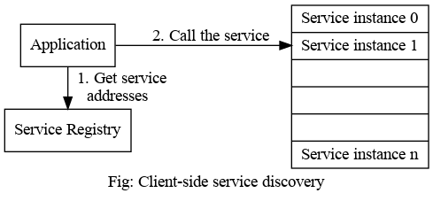

-   Server-side service discovery: Access the register indirectly via a load balancer, a special server that forwards requests to available instances.

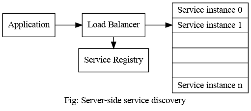

## Service Health monitoring

-   Pull model: Registry periodically performs health check for each known service.
-   Push model: The application renews its status by contacting the service registry.

## Service Discovery solutions

Popular service discovery solutions include HashiCorp Consul and Kubernetes.

In this project I have used hashicorp-consul for service discovery and this is status when all services are running.
Note: The in-memory implementation isn&rsquo;t fully developed yet. We have to abstract the logic to a new service which creates new registry in a hostPort and accepts connections from services on that hostPort. This is how we avoid sharing the same registry object among multiple services. Since HashiCorp-Consul already has this implementation, we proceed to go with that.

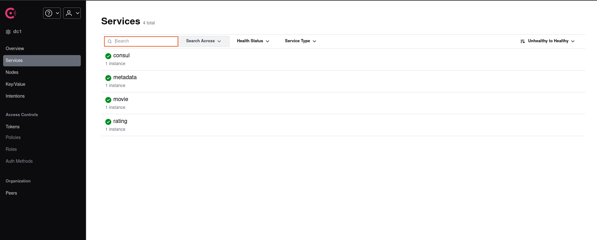

In the following image, we see that the movie microservice is correctly calling the metadata microservice with its correct URL.

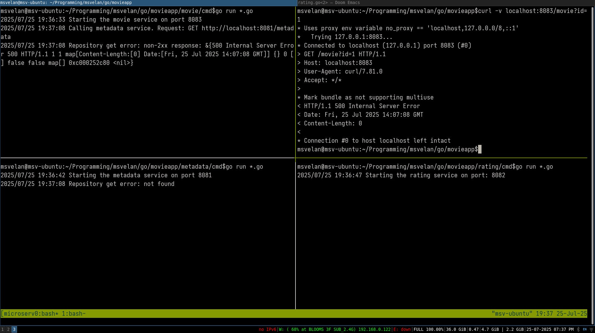

# Serialization and Deserialization of data

Currently we are using JSON for serialization of data and passing it over HTTP for communication between services. The issue with using JSON format is that it can be slower compared to other formats and the size is more.

There are other data serialization formats such as XML (size is largest compared to its alternatives), YAML(greater size after serialization, supports comments), Apache Thrift(requires defining models in their own format, 30% to 50% lesser size compared to XML or JSON, there are better options for encoding), Apache Avro (supports versioning, we can define data in JSON or Avro IDL), Protocol buffers (simplicity of language, small data output size, high performance, protocol evolution, define services and compile to target programming language).

To put into perspective, the script in the `cmd/sizecompare` directory is used to measure the size of the serialized sample data and speed of serialization comparing JSON, XML and protobuffers and here is the result:

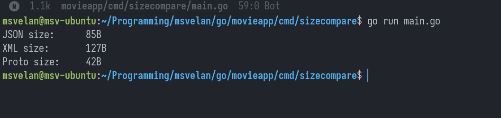

We see that XML serialized data is almost 40% more than JSON serialized data, whereas Proto serialized data is less than 50% of the JSON serialized data.

Comparing the serialization speed:

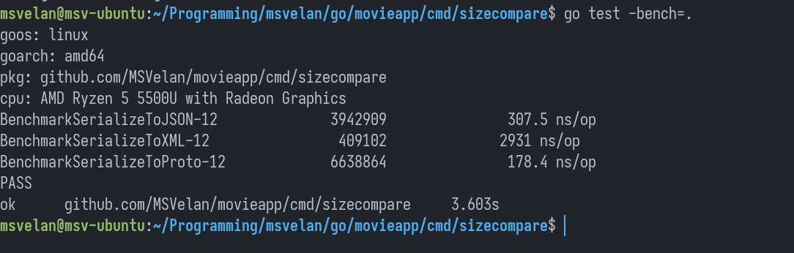

Here we see that Proto serialization is atleast 40% faster than JSON serialization and almost 16 times faster than XML serialization.

Protocol buffers is a popular option and we will be using this for our project.

# Synchronous Communication

In this form of communication, services communicate through request-response model. We have implemented synchronous communication through HTTP protocol.
gRPC is useful because it is a RPC framework. RPC frameworks allow generation of client code to connect and send data to other microservices as well generation of server code for accepting connections and receive data. They offer authentication, context propagation and documentation generation.

gRPC uses HTTP/2 as transport protocol and protocol buffers as serialization format.

Steps for converting HTTP API endpoints to gRPC:

-   Write the service functions and messages in the `api` directory and generate the gRPC code in some other directory, say gen.
-   Create the mapping logic for converting to and from the internal model to the generated gRPC model.
-   Implement the gRPC handlers for each services
    -   For this create a handler with `gen.UnImplementedServiceServer` and the service controller which was already implemented.
    -   Add logic to create a new handler and implement the services as described in the generated code, attach it to the handler.
-   Change the `main.go` for each of the services to create a new handler, grpc server, listen to the tcp network for a hostPort, `gen.RegisterServiceServer(grpc server, handler)` and then serve the listener in gRPC server created.

-   For the movie service, added an util function in `internal/grpcutil` directory which takes in serviceName and registry and returns a gRPC new client from the active service instances of the service.
-   Implement the gRPC gateway for both metadata service and rating service inside the `movie/internal/gateway` directory.
    -   For this, create a new Gateway struct with registry, implement function to create a new Gateway.
    -   The metadata gateway should just get the metadata. To implement this, get an active connection from metadata service, create new metadata client and then call the `GetMetadata` function from the generated gRPC code and return the data generated from the response.
    -   Do the same thing for the rating gateway which implements `GetAggregatedRating` function.
-   Update the main function of the movie service to create the gRPC handler, create gRPC server, listen to the tcp network for a hostPort, register movie service server with the handler and serve the listener in gRPC server created.

Here is the output after integration of gRPC to the services and testing with grpcurl:

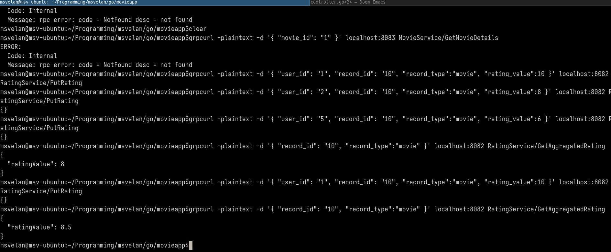

# Asynchronous Communication

## Basics

Asynchronous communication is a communication between sender and one or more receivers, where a sender does not necessarily expect an immediate response to the messages. It can take an arbitrary amount of time for the receiver to respond or not at all.

Asynchronous communication can be even faster than synchronous communication as it avoids context switching when handling multiple requests. So far we have just used synchronous communication.

## Pros and Cons

### Pros

-   Streamlined processing of messages: No need to wait to process and get the response.
-   Ability to decouple the sending and processing of requests.
-   Better load balancing: Avoids uneven request loads and sudden spikes of request.

It is better suited for the cases such as long running processing tasks, send once and processed by multiple clients.

### Cons

-   More complex error handling.
-   Reliance on additional components for message delivery.

## Message Broker

It is an intermediary component in the communication chain that plays multiple roles such as message delivery, message transformation, message aggregation and message routing.

It guarantees delivery and provides various levels of guarantees such as:

-   **At-least once**: Message gets delivered at-least once, but maybe delivered multiple times in case of failures (lossless).
-   **Exactly once**: Message broker guarantees message delivery and it will be delivered exactly once (lossless).
-   **At-most once**: The message can be delivered 0 or 1 time (lossy).

They are capable of handling multiple forms of communication models such as pub-sub or message queues, etc.

## Patterns of asynchronous communication

### Publisher-subscriber model

Every component can publish messages and subscribe to the relevant ones. The relevant messages are delivered to the subscribers without directly contacting the publisher and check if there is any new data to consume. Follows one-to-many communication.

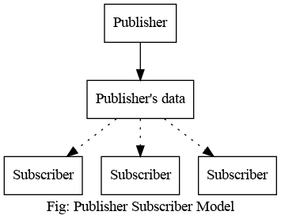

### Message Queue model

Used where the event has to be consumed only once. (One-to-one communication)

## Event Driven Architecture(EDA) Patterns

Refer to my blog on the 4 commonly used EDA Patterns: <https://msvelan.netlify.app/p/event-driven-architecture/>

## Using Apache Kafka as the message broker

Few terminologies before we go further:

-   Component that produces message is called **producer**.
-   Messages are published in a sequential order to objects called **topics**.
-   Each message in a topic, has a unique numerical **offset** in it.
-   **Partitioning**: Allows data locality, for example we can partition we can partition the data using UserID, this allows data for any user is stored in a single topic partition, simplifying data search across topic partitions. `groupID` is used for partitioning.
-   Component that consumes messages of existing topics is called **consumer**

Say we want to work with some ratings provider(eg: IMDB), which will provide ratings for a movie to us. We need to ingest these ratings along with the rating API that we created earlier. We can make this communication async as we don&rsquo;t need to process this bulk information immediately.

For this I have used Apache Kafka as message broker which stores the rating data. We are going to handle the new rating data as soon as it gets published. We use the JSON format for serialization for simplicity.

For the publisher, let&rsquo;s have an example application that produces rating data and let&rsquo;s have the rating service subscribe to it.

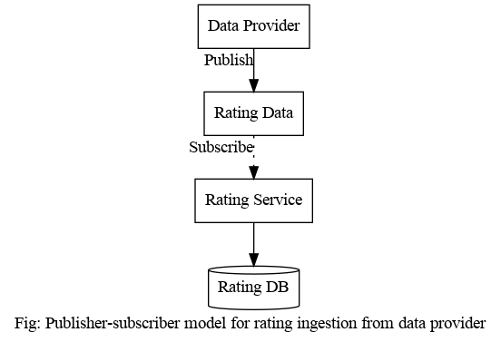

### Application to produce ratings data

-   Create `RatingEvent` struct in the `rating/pkg/model/rating.go` file.
-   Create `cmd/ratingingester/main.go` file which essentially creates a new Kafka producer, reads the `ratingsdata.json` file to and decodes them to `[]model.Metadata` using json decoder.
-   Use the created producer to produce the Kafka message with the event after converting the metadata to JSON and have a timeout for all the events to get produced.

### Rating Data Consumer

-   Create `rating/internal/ingester/kafka/ingester.go` file.
-   Create an `Ingester` struct that consists of Kafka consumer and the topic(string) which it has to subscribe to.
-   Add `NewIngester` function which creates new Kafka consumer and returns `Ingester` object.
-   Create `Ingest` function and attach it to `Ingester` struct, which takes in context and returns `model.RatingEvent` channel and implement the logic.
-   The next thing is to implement the controller logic. Create an interface which has the same definition as Ingest function which we created. Now `Ingester` struct implements this interface and we add the interface created to the controller, change the definition of the controller.
-   Create `StartIngestion` function which gets the channel from the `Ingest` function and puts each event in the channel to ratings database (currently in-memory).
-   The final step is to update the changes in the `rating/cmd/main.go` file. Create `NewIngester` object and pass it to the controller. Call the `StartIngestion` function from the controller in a go routine to run the `ingester` along with the API implemented.

## Results

Before running the producer script in `cmd/ratingingester/main.go`, if we run `rating/cmd/main.go`, we get the following output as there is no topic such as rating is available still.

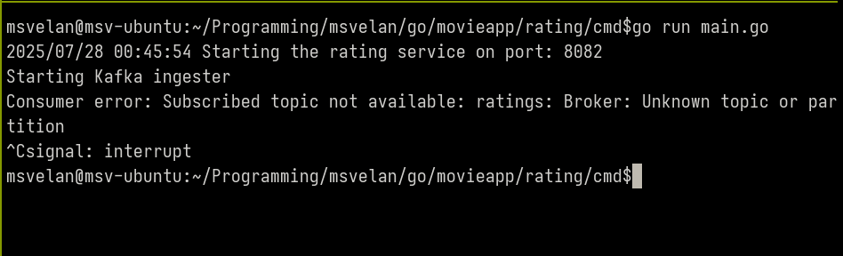

In the following figure I run `rating/cmd/main.go` file first which listens for the channel and then run the producer script (`cmd/ratingingestor/main.go`). We see that the data is being read correctly in the rating service(bottom figure). We also verify this in the top half of the figure by using grpcurl to call the RatingService/GetAggregatedRating gRPC endpoint.

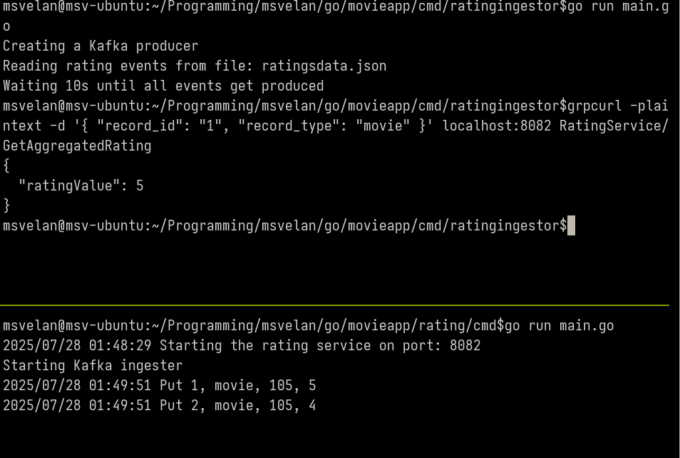

